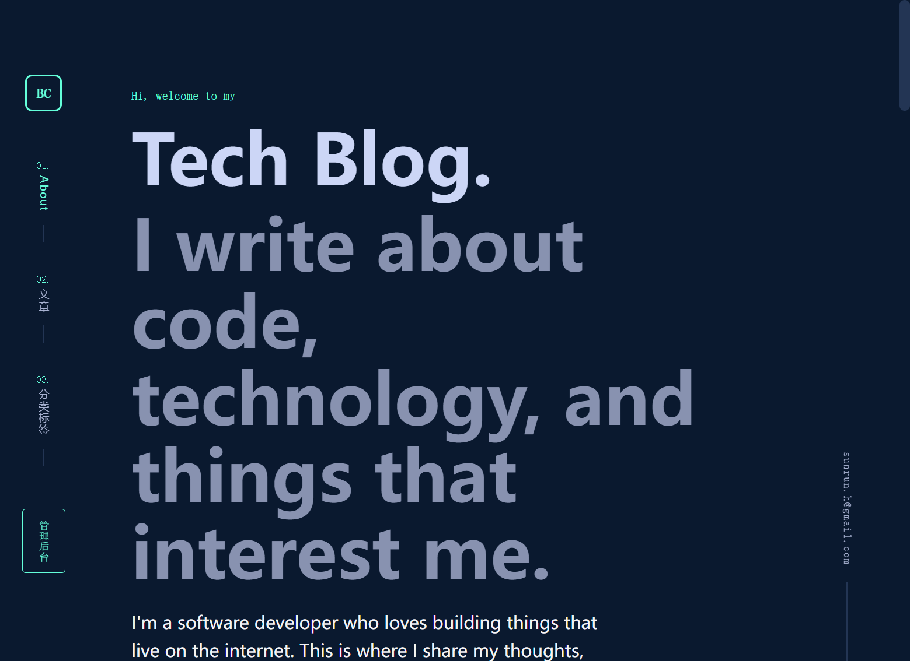
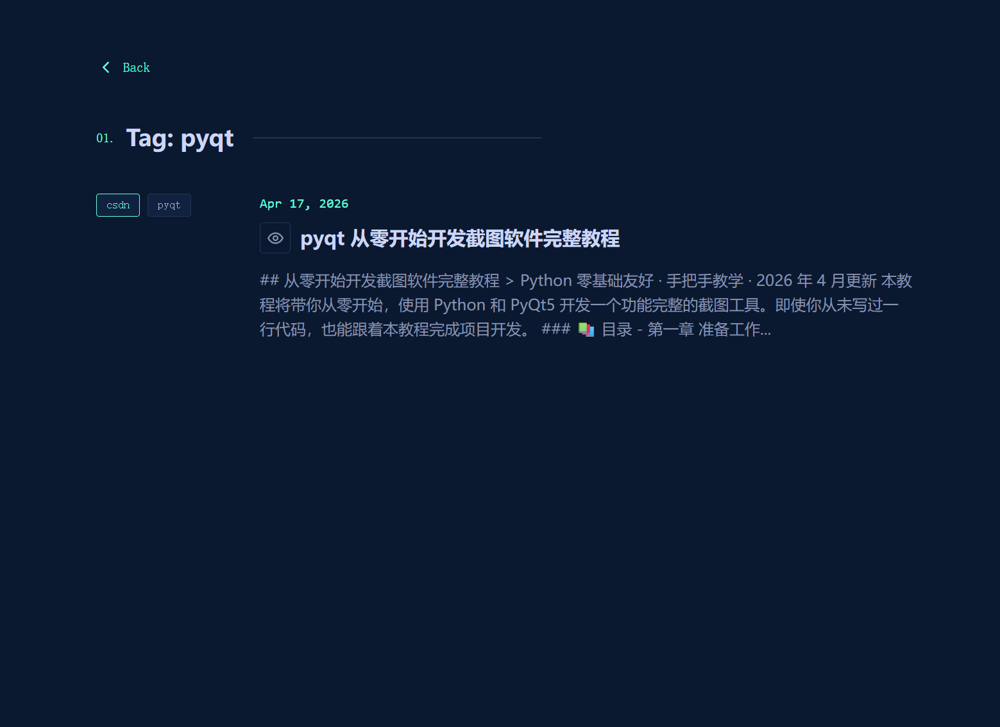

# MCSDN


MCSDN 是一款现代化、轻量级的前后端分离开发者技术博客与内容社区平台。项目采用主流企业级技术栈构建，聚焦技术创作者的核心使用场景，提供文章管理、标签体系、个人作品集展示等核心能力，同时通过工程化优化与缓存设计，保障系统的高性能与流畅使用体验，为开发者打造轻量化的个人技术内容阵地。

---

## ✨ 核心特性
- **前后端分离架构**：彻底解耦前后端开发与部署，已完成端口占用自动检测与服务重启能力优化，大幅提升本地开发与部署的稳定性
- **高性能缓存设计**：集成 Redis 分布式缓存，针对高频访问接口做专项优化，显著降低数据库压力，提升页面加载与接口响应速度
- **现代化前端交互**：持续优化前端页面布局与组件样式，调整首页作品集与文章列表的展示优先级，贴合开发者的浏览与使用习惯
- **完善的内容管理**：支持技术文章的发布、编辑、分类与检索，配套完整的标签管理体系，实现内容的精细化归类与快速筛选
- **个人技术名片**：内置作品集展示模块，支持开发者个人项目、作品的集中呈现，打造专属个人技术品牌
- **体系化迭代规划**：已制定完整的三阶段产品路线图，持续迭代社区互动、用户体系、内容生态等进阶能力

---

## 🖼️ 项目预览
| 首页预览 | 标签页功能 |
|----------|------------|
|  |  |

---

## 📦 技术栈
### 前端技术栈
- 核心框架：现代化 SPA 框架（Vue3/React）
- 工程化：Vite/Webpack + TypeScript
- UI 组件：主流企业级组件库
- 样式方案：CSS 预处理器 + 原子化 CSS
- 状态管理：Pinia/Redux

### 后端技术栈
- 核心框架：Spring Boot
- 数据持久层：MyBatis/MyBatis-Plus
- 数据库：MySQL
- 缓存中间件：Redis
- 接口规范：RESTful API

### 工程化与配套
- 版本控制：Git + GitHub Flow
- AI 辅助开发：Trae AI 工程化配置 + Claude 开发协作规范
- 项目管理：完整的规划文档与迭代路线图

---

## 🚀 快速开始
### 环境要求
- Node.js 16.0+ （前端运行环境）
- JDK 8+ （后端运行环境）
- MySQL 5.7+/8.0+
- Redis 6.0+
- Maven 3.6+

### 本地启动步骤
1. 克隆仓库到本地
```bash
git clone https://github.com/HsunR/MCSDN.git
cd MCSDN
```

2. 后端服务启动
```bash
# 进入后端目录
cd backend

# 配置数据库与Redis连接
# 修改 application.yml 中的数据库地址、账号密码，以及Redis连接配置

# Maven 打包并启动
mvn clean install
mvn spring-boot:run
```

3. 前端项目启动
```bash
# 进入前端目录
cd ../frontend

# 安装依赖
npm install
# 或 yarn install / pnpm install

# 本地开发启动
npm run dev
```

4. 访问项目
- 前端地址：`http://localhost:5173`（默认）
- 后端接口地址：`http://localhost:8080`（默认）

---

## 📁 项目结构
```
MCSDN/
├── .planning/                 # 项目规划目录，包含迭代计划、需求文档、分阶段路线图等
├── .trae/specs/               # Trae AI 工程化配置与开发规范文件
├── backend/                    # 后端服务源码，包含核心业务逻辑、接口层、数据层、缓存配置等
├── frontend/                   # 前端项目源码，包含页面组件、交互逻辑、样式资源、路由配置等
├── .gitignore                  # Git 版本控制忽略配置文件
├── CLAUDE.md                   # 项目开发协作规范、AI 辅助开发指南文档
├── screenshot_home.png         # 项目首页功能预览截图
├── screenshot_tag.png          # 标签页功能预览截图
└── README.md                   # 项目说明文档（本文件）
```

---

## 🗺️ 项目路线图
项目已制定三阶段迭代规划，持续完善产品能力：
- **Phase 1 基础核心版本（已完成核心开发）**：完成前后端基础架构搭建，实现文章核心CRUD、标签管理、作品集展示模块，集成Redis缓存，完成前端基础UI与布局优化
- **Phase 2 功能增强版本**：完善用户体系与权限管理，新增文章评论、Markdown编辑器增强、全文检索、个人数据统计等核心功能，优化交互体验
- **Phase 3 生态完善版本**：新增社区互动、专栏订阅、消息通知、SEO优化、移动端适配，完善自动化部署方案与高可用架构设计
